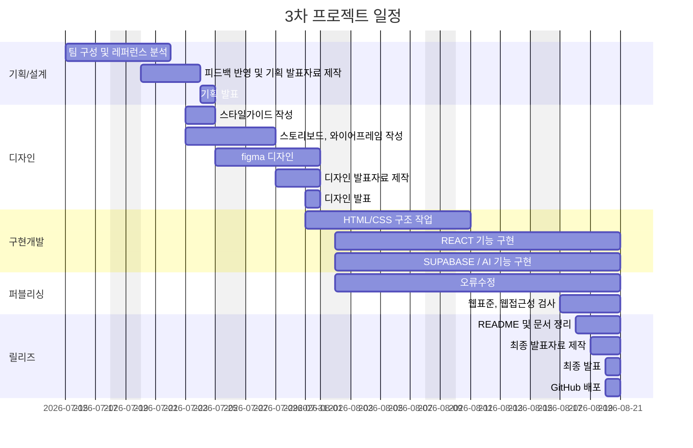

# 한끼랩 (3차 프로젝트)

- 과정명: 프론트엔드 13기 개발자 양성
- 기간: 2026/04/07 ~ 2026/08/21
- 3차 프로젝트: 2026/07/15 ~ 2026/08/21

## 🔗 빠른 링크

- ⚙️ 개발 컨벤션(노션) : [5조 한끼연구소](https://app.notion.com/p/oreumi/7-39febaa8982b8049b894fcd3b05ec4f1)
- 📑 기획서(피그마 슬라이드): [기획서] (https://www.figma.com/slides/uawhVhg1eTzhXLcoq8Nmyc)
- 🎨 디자인 원본: [피그마] https://www.figma.com/design/b758BtZOYApbJJXB2hqSpE/7%EC%A1%B0-%ED%94%BC%EA%B7%B8%EB%A7%88?node-id=0-1&t=f5ifrSUpquykABNI-1

## 1. 프로젝트 개요

### 1.1 목표

-
- ㅇ
- ㅇ
- ㅇ

### 1.2 👥 팀원

|           이름           | 역할                                                |                   GitHub                    |
| :----------------------: | :-------------------------------------------------- | :-----------------------------------------: |
| **황시원** <br> _(팀장)_ | 기획 / 디자인 / 레시피 상세 퍼블리싱                |   [@isnow-x](https://github.com/isnow-x)    |
|        **김정우**        | 디자인 / 메인 / 레시피 목록 퍼블리싱                | [@casperjwk](https://github.com/casperjwk/) |
|        **김찬희**        | 기획 / 디자인 / 마이페이지 / 즐겨찾기 퍼블리싱      |                    [@]()                    |
|        **최성호**        | 기획 / 디자인 / 로그인 / 회원가입 / 관리자 퍼블리싱 |                    [@]()                    |
|        **최예빈**        | 기획 / 디자인 / 메인 / 헤더 / 푸터 퍼블리싱         |                    [@]()                    |

### 1.3 🗓️ 마일스톤



## 2. 개발 환경 및 배포

### 2.1 개발 스택

#### Frontend

☑️ React

#### Tools

- ☑️ Version Control: Git & GitHub
- ☑️ Design: Figma
- ☑️ Editor: VS Code

### 2.2 배포 URL

- 링크

## 3. 프로젝트 구조

```

EST-fe-13-3rd-project/
hankkilab/
│
├─ public/                         # 정적 파일
│  └─ images/                      # 로고, 배너 등 공통 이미지
│
├─ src/
│  │
│  ├─ components/                 # 여러 페이지에서 재사용하는 UI
│  │
│  │  ├─ common/                  # 사이트 전체 공통 컴포넌트
│  │  │  ├─ Header.jsx            # 상단 헤더 / 메뉴
│  │  │  ├─ Footer.jsx            # 하단 푸터
│  │  │  ├─ Button.jsx            # 공통 버튼
│  │  │  ├─ Badge.jsx             # 적합·주의·대체 필요 등의 상태 태그
│  │  │  ├─ MainLayout.jsx        # Header·페이지·Footer 공통 레이아웃
│  │  │  └─ common.module.css     # 공통 컴포넌트 CSS Module
│  │  │
│  │  ├─ recipe/                  # 레시피 관련 공통 컴포넌트
│  │  │  ├─ RecipeCard.jsx        # 레시피 목록/추천 등에 사용하는 카드
│  │  │  ├─ RecipeFilter.jsx      # 알레르기·비건 유형 필터
│  │  │  ├─ IngredientList.jsx    # 재료 목록 출력
│  │  │  ├─ RecipeSteps.jsx       # 조리 순서 출력
│  │  │  └─ recipe.module.css     # 레시피 컴포넌트 스타일
│  │  │
│  │  └─ user/                    # 사용자 식단 정보 관련 컴포넌트
│  │     ├─ AllergyTag.jsx        # 알레르기 조건 표시
│  │     ├─ VeganTag.jsx          # 비건 유형 표시
│  │     └─ user.module.css       # 사용자 컴포넌트 스타일
│  │
│  ├─ pages/                      # 실제 페이지 단위 화면
│  │
│  │  ├─ home/
│  │  │  ├─ HomePage.jsx          # 메인 페이지
│  │  │  └─ HomePage.css
│  │  │
│  │  ├─ recipe/
│  │  │  ├─ RecipeListPage.jsx    # 레시피 목록 페이지
│  │  │  ├─ RecipeListPage.css
│  │  │  ├─ RecipeDetailPage.jsx  # 레시피 상세 페이지
│  │  │  └─ RecipeDetailPage.css
│  │  │
│  │  ├─ my/
│  │  │  ├─ MyPage.jsx            # 마이페이지
│  │  │  ├─ MyPage.css
│  │  │  ├─ FavoritePage.jsx      # 즐겨찾기 페이지
│  │  │  └─ FavoritePage.css
│  │  │
│  │  ├─ auth/
│  │  │  ├─ LoginPage.jsx         # 로그인 페이지
│  │  │  ├─ LoginPage.css
│  │  │  ├─ SignupPage.jsx        # 회원가입 페이지
│  │  │  └─ SignupPage.css
│  │  │
│  │  ├─ admin/
│  │  │  ├─ AdminPage.jsx         # 관리자 페이지
│  │  │  └─  AdminPage.css
│  │  │
│  │  └─ notfound/
│  │     ├─ NotFoundPage.jsx      # 404 페이지
│  │     └─ NotFoundPage.module.css
│  │
│  ├─ lib/
│  │  └─ supabase.js              # Supabase 프로젝트 연결 설정
│  │
│  ├─ services/                   # Supabase와 실제 통신하는 함수
│  │  ├─ recipeService.js         # 레시피 조회 / 상세 조회
│  │  ├─ authService.js           # 로그인 / 회원가입 / 로그아웃
│  │  ├─ userService.js           # 사용자 식단 정보 조회 / 수정
│  │  ├─ favoriteService.js       # 즐겨찾기 등록 / 삭제 / 조회
│  │  └─ adminService.js          # 관리자용 데이터 조회
│  │
│  ├─ utils/                      # 데이터 가공 및 공통 함수
│  │  ├─ recipeFilter.js          # 레시피 필터링 관련 함수
│  │  └─ recipeAnalysis.js        # 사용자 조건과 레시피 비교
│  │
│  ├─ context/
│  │  └─ AuthContext.jsx          # 현재 로그인 사용자 상태 관리
│  │
│  ├─ styles/
│  │  ├─ reset.css                # 브라우저 기본 스타일 초기화
│  │  ├─ normalize.css            # 브라우저 간 기본 스타일 차이 보정
│  │  └─ global.css               # 사이트 전체 공통 스타일
│  │
│  ├─ App.jsx                     # 페이지 라우팅 설정
│  └─ main.jsx                    # React 앱 시작점
│
├─ .env                           # Supabase URL, API Key 보관
├─ package.json                   # 설치된 패키지 관리
├─ vite.config.js                 # Vite 설정
├─ README.md                      # README
└─ .gitignore                     # GitHub에 올리지 않을 파일 설정

```

## 4. 향후 개선 사항

- ㅇ
- ㅇ
- ㅇ
- ㅇ
- ㅇ

## 5. 제작 후기

ㅇ

## 6. 기획/디자인 문서

- **기획서(피그마 슬라이드)**: 사용자 흐름 설계, 리뉴얼 방향성, 스타일 가이드, 개발 기준 및 주요 구현 내용
  링크: ㅇ
- **디자인 원본(피그마)**: 컴포넌트, 컬러/타이포 스케일, 반응형 레이아웃, 아이콘
  링크: ㅇ

### 7. 미리보기

<!-- /public/readme/ 폴더에 썸네일 PNG를 넣고 경로를 맞춘다 -->

[](링크 "피그마 슬라이드로 이동")
[](링크 "피그마 디자인으로 이동")

```

```
